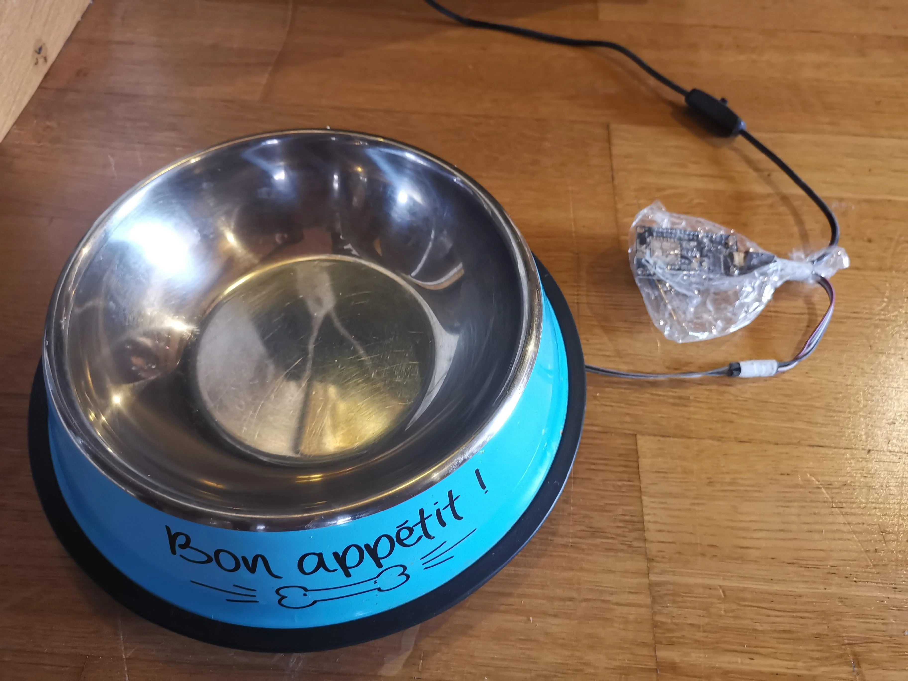
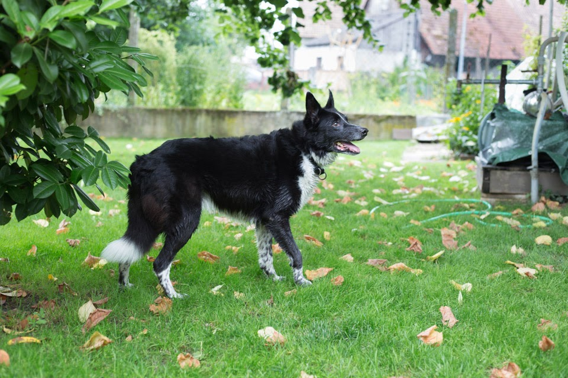
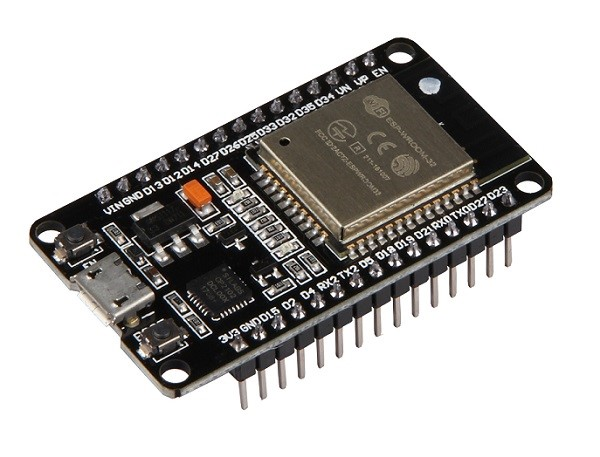
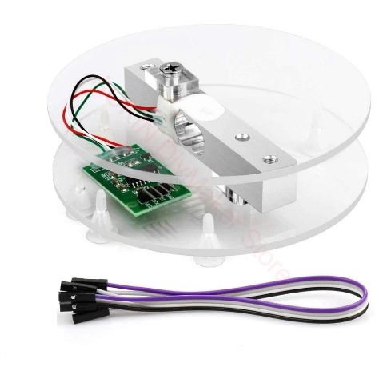
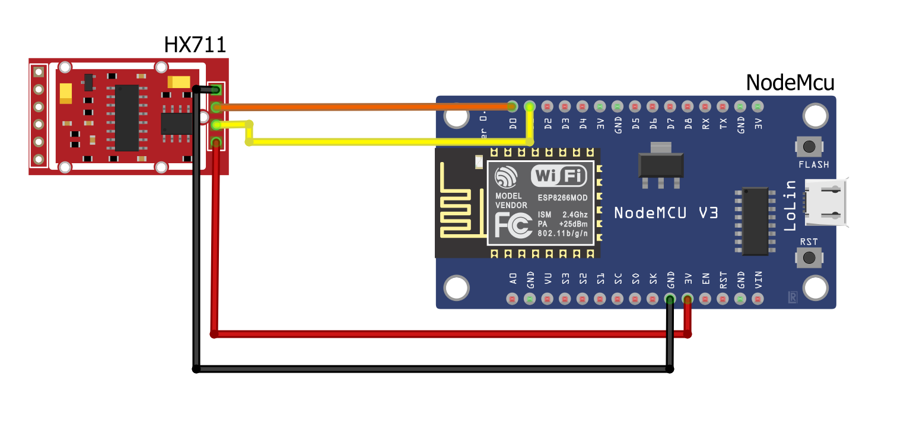
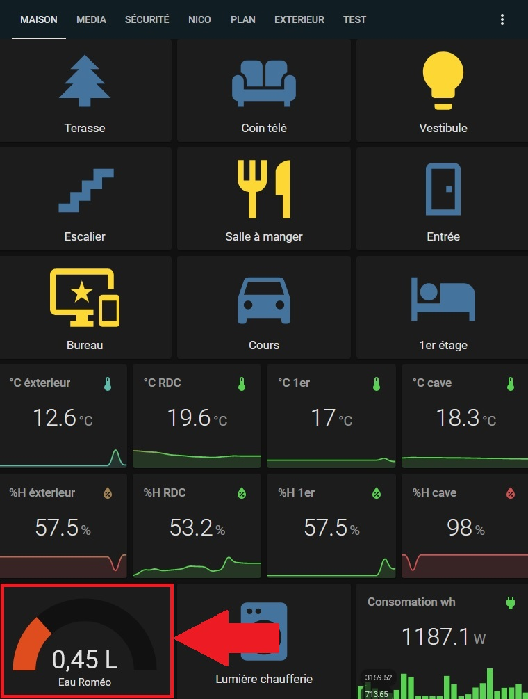

# Connected bowl :dog2:

## Presentation :information_source:

This project aims to connect a water or food bowl for dogs or cats to a home automation system (<a href="https://www.home-assistant.io/">HomeAssistant</a>). \
The main interest is to **provide information on the current weight of the bowl** and then to **trigger a visual feedback or sound alerts** in case the level becomes low. 
- Approximate cost of project :heavy_dollar_sign: : **$8.00** 
- Approximate set-up time :watch: : **4 hours**

## Prerequisites :arrow_heading_up:

-   A **wifi** network
-   A compatible **home automation system**, in the example used here : <a href="https://www.home-assistant.io/">HomeAssistant</a>
-   A **bowl**
-   The necessary to make **solder** or some<a href="https://www.aliexpress.com/item/1005003052170258.html?src=google&src=google&albch=shopping&acnt=248-630-5778&isdl=y&slnk=&plac=&mtctp=&albbt=Google_7_shopping&aff_platform=google&aff_short_key=UneMJZVf&&albagn=888888&isSmbAutoCall=false&needSmbHouyi=false&albcp=10191220526&albag=107473525328&trgt=539263010115&crea=fr1005003052170258&netw=u&device=c&albpg=539263010115&albpd=fr1005003052170258&gclid=Cj0KCQjwqp-LBhDQARIsAO0a6aL09VfQg-ypNeFRJKBXkJGkGlaXHUrfbIuMrFW5oHXrIt7QZDsey7gaAkNSEALw_wcB&gclsrc=aw.ds"> **Dupont cables**</a> *(Depending on the sensor purchased, the cables to connect the HX711 module to the NodeMcu are included)*.
-   What you need to **falsh EspHome** on a NodeMcu *(only sofware)*

## Material :toolbox:

-   1 X <a href="https://www.aliexpress.com/item/33049521755.html?spm=a2g0o.productlist.0.0.61048764yEn3Z8&algo_pvid=b2e6d4c2-1973-4d39-9d1c-41c5f91445de&algo_exp_id=b2e6d4c2-1973-4d39-9d1c-41c5f91445de-2&pdp_ext_f=%7B%22sku_id%22%3A%2210000015406675829%22%7D">USB power supply</a> : $1.5
-   1 X <a href="https://www.aliexpress.com/item/4000160133215.html?spm=a2g0o.productlist.0.0.398b72fa8B8vsV&algo_pvid=99beede7-23b1-4714-9472-b041a2508047&algo_exp_id=99beede7-23b1-4714-9472-b041a2508047-0&pdp_ext_f=%7B%22sku_id%22%3A%2210000000516093098%22%7D">NodeMcu</a> : $3
-   1 X <a href="https://www.aliexpress.com/item/1005001425591567.html?spm=a2g0o.productlist.0.0.4dd11f7b506olR&algo_pvid=e6991931-4cac-4b99-a024-a31e79130479&algo_exp_id=e6991931-4cac-4b99-a024-a31e79130479-40&pdp_ext_f=%7B%22sku_id%22%3A%2212000016062336368%22%7D"> weight sensor with HX711module</a> : $3.5

	
	

## Hardware installation :hammer_and_wrench:

I strongly recommend that you choose a weight sensor **with the 2 acrylic trays** as shown in the previous listing. \
The load cell is located between two trays that are screwed to two opposite sides of the cell. The profile of the assembly is reminiscent of the letter "S". This is perfect for this project \
Otherwise it is possible to take the sensor alone with the HX711 module and to **print in 3D yourself your support** which will be used to put the bowl on. \
I also recommend if possible to **print a protective case for the Esp8266** if you have a 3D printer. Otherwise any <a href="https://www.aliexpress.com/item/32980118610.html?spm=a2g0o.productlist.0.0.313574a51Mtorh&algo_pvid=e005df0d-1ffe-4dee-b5ca-a1445f0056b3&algo_exp_id=e005df0d-1ffe-4dee-b5ca-a1445f0056b3-2&pdp_ext_f=%7B%22sku_id%22%3A%2266816628372%22%7D">plastic box</a> will do. \
Concerning the connection of the sensor to the Esp : \
Simply connect the following pins from the HX711 to your Esp8266:

-   HX711 -> Esp8266
-   VCC -> 3.3V
-   GND -> GND
-   DAT -> D0 (digital data)
-   CLK -> D1 (clock signal)

## Software :computer:

The easiest way is to use <a href="https://esphome.io/">**EspHome**</a>, it's a system working under Esp8266 and Esp32 allowing you to **quickly deploy different sensors** without needing to know how to code. It includes various very useful functions like remote deployment of updates. \
**If you have never used EspHome I strongly advise you to watch different videos like: <a href="https://www.youtube.com/watch?v=iufph4dF3YU&ab_channel=EverythingSmartHome">Getting started with ESPHome</a>**

Simply:

-   In ESPHome

    -   Add a new node
    -   Use <a href="https://github.com/Nico-1337/ConnectedDogBowl/blob/main/dogbowl.yaml">the configuration file of this GitHub</a>
        -   In the configuration you will have to change :
            -   The configuration of your wifi
            -   If you use homeAssistant :
                -   The password for your Home assistant API
            -   The OTA password
            -   (Optional)
                -   unit_of_measurement
                -   name
                -   update_interval
    -   You will then have to flash your Esp8266 via EspHome with this configuration
    -   Then you just have to integrate this new node in your home automation system, this is very easy on HomeAssistant, the auto-discover should manage to find this new node automatically.
    -   You will then need to calibrate your sensor, simply change the values in the 'calibrate_linear' option.
        -   These options are in the form: "gross value -> return value".
            -   In the following example: "555000 -> 1
                -   555000' is the value read by the HX711 module
                -   1' will be the value returned to your home automation system.

